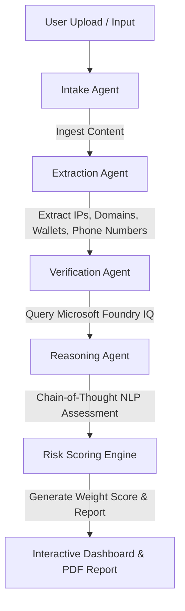
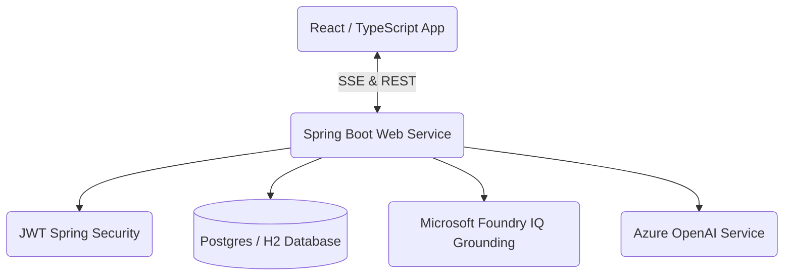

<div align="center">

# 🛡️ AgentGuardian AI

**Autonomous, AI-Powered Fraud Investigation Platform**  
*Grounding conversational AI in live threat intelligence via Microsoft Foundry IQ & Azure OpenAI.*


[](https://agentguardian-ui.onrender.com)
[](#)
[](#)
[](#)
[](#)
[](#)
[](#)
[](#)
[](#)
[](#)
[](#)
[](https://opensource.org/licenses/MIT)
[](https://github.com/SatyamKumar7911/AgentGuardian-AI/graphs/contributors)


**[🔗 Open Live Web Application](https://agentguardian-ui.onrender.com)** | **[🔗 Read Live Backend API Health](https://agentguardian-ai.onrender.com/actuator/health)**

---

<p align="center">
  <a href="#-project-overview">Overview</a> •
  <a href="#-key-features">Key Features</a> •
  <a href="#-system-architecture">Architecture</a> •
  <a href="#-technology-stack">Tech Stack</a> •
  <a href="#%EF%B8%8F-installation--setup">Setup Guide</a> •
  <a href="#-render-deployment-blueprint">Render Deployment</a> •
  <a href="#-api-documentation">API Docs</a> •
  <a href="#-hackathon-submission">Hackathon Details</a>
</p>

</div>

---

## 📈 Project Overview

**AgentGuardian AI** is a state-of-the-art, autonomous digital forensics and fraud investigation platform. It detects, dissects, and neutralizes modern cyber threats—such as phishing sites, fake job recruitment scams, advance-fee frauds, and deepfake-enabled financial requests—before they claim their next victim.

In an era where threat actors leverage generative AI to create hyper-realistic scams, standard rule-based scanners are obsolete. They generate massive false positives, fail to assess linguistic context, and place a heavy cognitive load on manual reviewers. 

### 💡 The AgentGuardian AI Solution
By deploying a **swarm of specialized, cooperative AI agents**, AgentGuardian AI replicates the precise steps of a human cyber-investigator:
1. **Intakes** suspicious files, emails, or texts.
2. **Extracts** high-fidelity forensic evidence (domains, IPs, crypto wallets, phone numbers).
3. **Verifies** findings against real-time global threat databases via **Microsoft Foundry IQ**.
4. **reasons** through the threat context using a Chain-of-Thought LLM.
5. **Formulates** explainable risk assessments and generates clear, actionable advice.

---

## 🎯 The Problem & Impact

* **$12.5 Billion** lost to internet fraud in 2023 alone (FBI IC3 Report).
* **74%** of organizations experienced successful phishing attacks last year.
* **Deepfake-enabled fraud** has grown by **3000%** year-over-year.

Ordinary users and small businesses lack the tools to verify complex domain registrations, trace cryptographic wallets, or detect synthetic voice/text signatures. They need an automated security partner to investigate digital communications on their behalf.

---

## 🛠️ Cooperative Multi-Agent Flow

AgentGuardian AI processes uploads through a highly orchestrated, multi-agent lifecycle:



1. **Intake Agent:** Ingests emails (`.eml`), PDFs, documents, or plain text securely.
2. **Extraction Agent:** Uses regex and natural language parsing to isolate key risk entities.
3. **Verification Agent:** Queries **Microsoft Foundry IQ** to cross-reference extracted entities against real-world threat feeds.
4. **Reasoning Agent:** Analyzes linguistic patterns, tone, urgency cues, and contradictions (e.g., requesting upfront fees in crypto).
5. **Risk Scoring Engine:** Computes a transparent, weighted risk score (0-100) and writes audit logs.

---

## ✨ Key Features

* **🛡️ Live Investigation Engine:** Orchestrates background tasks asynchronously using Spring's `@Async` architecture, communicating live event progress to the frontend via Server-Sent Events (SSE).
* **🌐 Microsoft Foundry IQ Grounding:** Prevents LLM hallucinations by cross-checking domain registrations, blacklist statuses, and IP reputations against live, authoritative threat datasets.
* **💰 Scam Specialization:** Core reasoning engines optimized to detect:
  * **Job Scams:** Fake recruiter onboarding, advance-fee equipment scams.
  * **Phishing & Typosquatting:** Domain mimicry, non-SSL setups, credential theft.
  * **Deepfake Contexts:** Synthetic urgencies, unauthorized out-of-band transaction requests.
  * **Investment & Crypto Frauds:** High-yield investment programs (HYIPs), suspicious wallet transfers.
* **📂 Secure Evidence Vault:** A searchable database aggregating malicious IPs, domains, and phone numbers discovered across all system investigations.
* **📊 Dashboard Analytics:** High-level charts monitoring risk trends, threat level distribution, and detection efficiency.
* **📄 PDF Export:** Generates clean, professional investigation briefs to share with compliance, security teams, or law enforcement.

---

## 🧬 System Architecture



* **Frontend:** React Single Page Application (SPA) powered by Vite, TypeScript, and Tailwind CSS. Features fluid animations (Framer Motion) and secure Axios middleware with JWT state sync.
* **Backend:** Enterprise Spring Boot 3 Java application exposing secure RESTful endpoints and real-time SSE streams.
* **Database:** JPA/Hibernate storage engine supporting seamless environment-based switching between H2 (local/dev testing) and PostgreSQL (production).
* **AI & Security:** Configured with stateless JWT security filters and dynamic external grounding parameters.

---

## 💻 Technology Stack

| Layer | Technology | Key Purpose |
| :--- | :--- | :--- |
| **Frontend** | React, TypeScript, Vite | Fast compilation, component safety, and SPA state management. |
| **Styling** | Tailwind CSS, Lucide Icons | Responsive layout, theme-appropriate dark mode, and visuals. |
| **Backend** | Java 17, Spring Boot 3 | Enterprise-grade API gateway, background thread safety, and modular security. |
| **Database** | PostgreSQL / H2 | Relational integrity, H2 fallback configuration for light testing. |
| **AI Layer** | Azure OpenAI, Foundry IQ | Natural Language Processing and verified cybersecurity dataset grounding. |
| **Security** | Spring Security 6, JJWT | Stateless JSON Web Token authentication protecting data routes. |

---

## 📁 Repository Structure

```text
AgentGuardian AI/
├── agentguardian-ui/           # React Frontend Source
│   ├── src/
│   │   ├── components/         # Reusable UI controls (Charts, Cards, Timelines)
│   │   ├── pages/              # Primary views (Dashboard, Evidence Vault, Login)
│   │   └── api.ts              # Axios instances & interceptors
│   ├── tsconfig.json           # TS configuration (configured for production build)
│   └── package.json            # Node configuration
├── agentguardian-api/          # Spring Boot Backend Source
│   ├── src/main/java/com/agentguardian/api/
│   │   ├── controller/         # REST Controllers & SSE endpoints
│   │   ├── service/            # Core business, AI reasoning, and Agent service
│   │   ├── model/              # JPA Data Entities (Investigations, Evidence)
│   │   └── security/           # JWT & Spring Security configs
│   ├── Dockerfile              # Multi-stage Eclipse Temurin Docker build config
│   └── pom.xml                 # Maven dependency tree
├── demo_data/                  # Sample test communications (.eml, .pdf)
└── README.md                   # Project documentation
```

---

## ⚙️ Installation & Setup

### Prerequisites
* **Java 17+** (JDK)
* **Maven 3.8+**
* **Node.js 18+**

### Step-by-Step Local Setup

1. **Clone the Repo:**
   ```bash
   git clone https://github.com/SatyamKumar7911/AgentGuardian-AI.git
   cd "AgentGuardian AI"
   ```

2. **Configure Environment Variables:**
   Create a `.env` file in `agentguardian-api` (or export to your environment):
   ```env
   JWT_SECRET=404E635266556A586E3272357538782F413F4428472B4B6250645367566B5970
   AZURE_OPENAI_KEY=your_azure_key
   AZURE_OPENAI_ENDPOINT=your_azure_endpoint
   FOUNDRY_IQ_TOKEN=your_foundry_iq_token
   ```
   *(Note: For local verification, the system will run simulation fallback logic if keys are left blank).*

3. **Launch Backend (Terminal 1):**
   ```bash
   cd agentguardian-api
   ./mvnw spring-boot:run
   ```
   *Runs on port `8081`.*

4. **Launch Frontend (Terminal 2):**
   ```bash
   cd agentguardian-ui
   npm install
   npm run dev
   ```
   *Runs on port `5173`.*

Open your browser to `http://localhost:5173` and log in using:
* **Username:** `admin`
* **Password:** `password`

---

## 🚀 Render Deployment Blueprint

AgentGuardian AI is fully optimized for **Render's Free Tier** (running on **H2 Database** for zero-cost, instant hackathon evaluation).

### Backend Settings (Web Service using Docker)
* **Environment:** `Docker` (compiles from [Dockerfile](file:///Users/satyamkumar/AgentGuardian%20AI/agentguardian-api/Dockerfile))
* **Root Directory:** `agentguardian-api`
* **Instance Type:** `Free`
* **Environment Variables:**
  * `SPRING_PROFILES_ACTIVE` = `prod`
  * `JWT_SECRET` = `your_secret_string`
  * `FRONTEND_URL` = `https://agentguardian-ui.onrender.com` (Your live frontend URL)

### Frontend Settings (Static Site)
* **Root Directory:** `agentguardian-ui`
* **Build Command:** `npm install && npm run build`
* **Publish Directory:** `dist`
* **Environment Variables:**
  * `VITE_API_BASE_URL` = `https://agentguardian-ai.onrender.com/api` (Your live backend URL)

---

## 🔌 API Documentation

All core routes (except auth) require a header: `Authorization: Bearer <JWT_TOKEN>`.

| Method | Endpoint | Description | Sample Output |
| :--- | :--- | :--- | :--- |
| `POST` | `/api/auth/login` | Log in and receive JWT token | `{"token": "eyJhbG..."}` |
| `POST` | `/api/investigations/upload` | Upload a suspicious file/PDF for analysis | `Investigation` object |
| `GET` | `/api/investigations` | Retrieve list of all investigations | `[Investigation, ...]` |
| `GET` | `/api/investigations/{id}` | Get complete results for an investigation | `InvestigationDetailDto` |
| `GET` | `/api/investigations/{id}/stream` | Subscribe to live agent SSE progress events | `Server-Sent Events` |
| `GET` | `/api/evidence` | Fetch all historical evidence items | `[Evidence, ...]` |

---

### Why AgentGuardian AI Stands Out:
* **Real-World Impact:** Attacks a growing multi-billion dollar social engineering threat.
* **Explainable Reasoning:** Utilizes structured reasoning agents that lay out clear evidence, preventing typical LLM "black-box" decision loops.
* **Grounding via Foundry IQ:** Rather than relying purely on LLM memory, AgentGuardian AI verifies domain age, IP blacklists, and context dynamically against global intelligence databases.

---

## 📞 Contact & Support

* **📧 Email:** satyam.kumar1183@gmail.com
* **📖 Documentation:** https://github.com/SatyamKumar7911/AgentGuardian-AI#readme
* **🐛 Bug Reports:** https://github.com/SatyamKumar7911/AgentGuardian-AI/issues
* **⭐ GitHub Repository:** https://github.com/SatyamKumar7911/AgentGuardian-AI
* **👤 Developer Profile:** https://github.com/SatyamKumar7911

---

## 📄 License

This project is licensed under the MIT License - see the LICENSE file for details.

---

<div align="center">
  🛡️ <b>Protecting Digital Lives, One Agent at a Time.</b>
</div>
